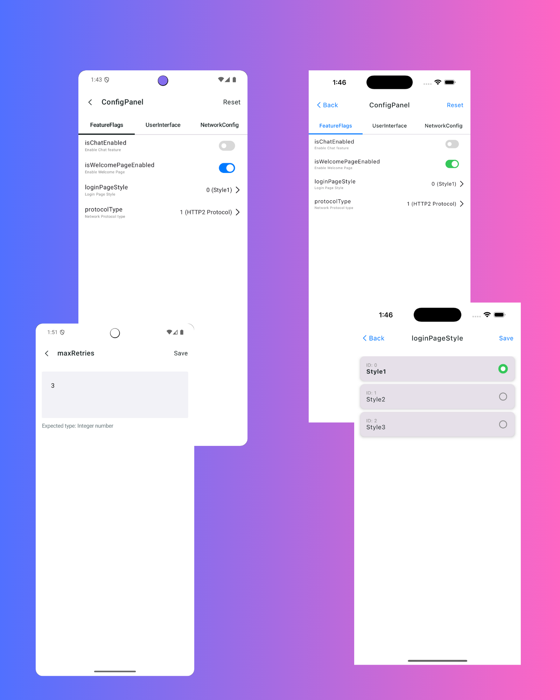

# AppConfig 🚀

[](https://central.sonatype.com/artifact/io.github.mambawow/appconfig-lib)
[](http://kotlinlang.org)
[](https://opensource.org/licenses/MIT)
[](https://kotlinlang.org/docs/multiplatform.html)

**Stop fighting with SharedPreferences and NSUserDefaults.** 

AppConfig is a powerful, type-safe configuration management library for Kotlin Multiplatform that transforms how you handle app settings with **zero boilerplate code**. Define your configuration as simple interfaces and let KSP generate all the boring stuff.

---

## 🔥 Why AppConfig?

### Before AppConfig 😫
```kotlin
// Android - SharedPreferences hell
val prefs = context.getSharedPreferences("settings", Context.MODE_PRIVATE)
val isDarkMode = prefs.getBoolean("is_dark_mode_enabled", false)
prefs.edit().putBoolean("is_dark_mode_enabled", true).apply()

// iOS - NSUserDefaults pain
val userDefaults = NSUserDefaults.standardUserDefaults
val isDarkMode = userDefaults.boolForKey("is_dark_mode_enabled")
userDefaults.setBool(true, forKey = "is_dark_mode_enabled")

// expect/actual nightmare for every single property...
```

### After AppConfig 🚀
```kotlin
@Config(groupName = "UserSettings")
interface UserSettings {
    @BooleanProperty(defaultValue = false, description = "Enable dark mode")
    var isDarkModeEnabled: Boolean
    
    @StringProperty(defaultValue = "https://api.example.com", description = "API endpoint")
    var apiEndpoint: String
}

// Usage - pure magic ✨
val settings = AppConfig.usersettings
settings.isDarkModeEnabled = true  // Automatically persisted!
```

**less code. 100% type safety. Works everywhere.**

---

## ✨ Features

- 🎯 **Zero Boilerplate**: Define configurations with simple annotations
- 🔒 **Type-Safe**: Compile-time validation and type safety
- 🌍 **True Multiplatform**: Native support for Android (SharedPreferences) & iOS (NSUserDefaults)
- 🎨 **Auto-Generated Admin UI**: Built-in configuration panel for debugging & A/B testing
- 📱 **Platform-Specific Configs**: Define Android-only or iOS-only settings
- ⚡ **KSP Powered**: Compile-time code generation for zero runtime overhead
- 🎛️ **Perfect for A/B Testing**: Type-safe feature flags and experiment groups

## 🚀 Quick Start

### 1. Add Dependencies

```kotlin
// build.gradle.kts
plugins {
    id("com.google.devtools.ksp") version "CURRENT_KSP_VERSION"
    id("io.github.mambawow.appconfig") version "0.0.3-alpha03"
}

kotlin {
    sourceSets {
        commonMain.dependencies {
            implementation("io.github.mambawow.appconfig:appconfig-lib:0.0.3-alpha03")
            // Optional: Admin UI panel
            implementation("io.github.mambawow.appconfig:appconfig-panel:0.0.3-alpha03")
        }
    }
}
```

### 2. Define Your Configuration

```kotlin
@Config(groupName = "UserSettings")
interface UserSettings {
    @BooleanProperty(defaultValue = false, description = "Enable dark mode")
    var isDarkModeEnabled: Boolean
    
    @StringProperty(defaultValue = "https://api.example.com", description = "API base URL")
    var apiEndpoint: String
    
    @IntProperty(defaultValue = 30, description = "Network timeout in seconds")
    var timeoutSeconds: Int
}
```

### 3. Use It Everywhere

```kotlin
// Access your configuration anywhere in your app
val settings = AppConfig.usersettings

// Read values
println("Dark mode: ${settings.isDarkModeEnabled}")
println("API: ${settings.apiEndpoint}")

// Update values (automatically persisted across platforms!)
settings.isDarkModeEnabled = true
settings.timeoutSeconds = 60
```

### 4. Add Admin Panel for A/B Testing

```kotlin
@Composable
fun DebugScreen() {
    ConfigPanel(
        configItems = AppConfig.getAllConfigItems()
    )
}
```

Perfect for QA teams to test different configurations without rebuilding the app!

<div align="center">

<br/>
<em>Auto-generated admin panel for easy configuration management</em>
</div>

---

## 🎯 Advanced Features

### Platform-Specific Configurations

Define configurations that only exist on specific platforms:

```kotlin
// androidMain/kotlin/.../AndroidSettings.kt
@Config
interface AndroidSettings {
    @BooleanProperty(defaultValue = false, description = "Enable Camera X")
    var isCameraXEnabled: Boolean
    
    @BooleanProperty(defaultValue = true, description = "Use Material You colors")
    var useMaterialYou: Boolean
}

// iosMain/kotlin/.../IOSSettings.kt  
@Config
interface IOSSettings {
    @BooleanProperty(defaultValue = true, description = "Enable haptic feedback")
    var enableHaptics: Boolean
    
    @BooleanProperty(defaultValue = false, description = "Use alternative app icons")
    var useAlternateIcons: Boolean
}
```

AppConfig automatically detects the source set and generates code only for the target platform!

### Type-Safe Feature Flags & A/B Testing

```kotlin
@Config
interface ExperimentConfig {
    @OptionProperty(description = "Onboarding A/B test")
    var onboardingGroup: OnboardingGroup
}

@Option
sealed class OnboardingGroup {
    @OptionItem(0, "Group A - Tutorial", isDefault = true)
    object Tutorial : OnboardingGroup()
    
    @OptionItem(1, "Group B - Interactive demo")
    object Demo : OnboardingGroup()
    
    @OptionItem(2, "Group C - Skip onboarding")
    object Skip : OnboardingGroup()
}

// Usage - type-safe and self-documenting
val experiment = AppConfig.experimentconfig
when (experiment.onboardingGroup) {
    OnboardingGroup.Tutorial -> showTutorial()
    OnboardingGroup.Demo -> showDemo()
    OnboardingGroup.Skip -> skipOnboarding()
}
```

No more wondering what "variant_2" means six months later!

---

## 📱 Supported Types

| Annotation | Kotlin Type | Description | Use Case |
|------------|-------------|-------------|----------|
| `@StringProperty` | `String` | Text values | API URLs, user names |
| `@BooleanProperty` | `Boolean` | True/false toggles | Feature flags, preferences |
| `@IntProperty` | `Int` | 32-bit integers | Timeouts, retry counts |
| `@LongProperty` | `Long` | 64-bit integers | Timestamps, large numbers |
| `@FloatProperty` | `Float` | 32-bit floating point | Animation speeds, ratios |
| `@DoubleProperty` | `Double` | 64-bit floating point | Precise calculations |
| `@OptionProperty` | `Sealed Class` | Enum-like choices | A/B test groups, themes |

---

## 🏗️ How It Works

AppConfig uses **Kotlin Symbol Processing (KSP)** to generate all the boilerplate at compile time:

```
┌─────────────────┐    KSP     ┌──────────────────┐
│ @Config         │ ────────→  │ Generated        │
│ Interface       │            │ Implementation   │
└─────────────────┘            └──────────────────┘
                                        │
                                        ▼
┌─────────────────┐            ┌──────────────────┐
│ Platform        │ ←──────────│ ConfigStore      │
│ Storage         │            │ Abstraction      │
└─────────────────┘            └──────────────────┘
```

**What gets generated:**
- ✅ Implementation classes with type-safe getters/setters
- ✅ Extension properties for easy access (`AppConfig.usersettings`)
- ✅ Platform-specific storage adapters (SharedPreferences/NSUserDefaults)
- ✅ Configuration metadata for admin UIs
- ✅ Bulk operations (reset, update from remote, etc.)

---

## 📦 Modules

| Module | Purpose | When to Use |
|--------|---------|-------------|
| `appconfig-annotation` | Core annotations | Always (automatically included) |
| `appconfig-processor` | KSP processor | Always (automatically included) |
| `appconfig-lib` | Runtime library | Always |
| `appconfig-panel` | Admin UI | Optional (debugging, A/B testing) |
| `appconfig-gradle-plugin` | Build tools | Always (automatically applied) |

---

## 🎪 Real-World Examples

### E-commerce App
```kotlin
@Config
interface ShoppingConfig {
    @BooleanProperty(defaultValue = false)
    var enableOneClickCheckout: Boolean
    
    @OptionProperty(description = "Checkout flow variant")
    var checkoutVariant: CheckoutVariant
    
    @IntProperty(defaultValue = 5)
    var maxCartItems: Int
}
```

### Social Media App
```kotlin
@Config  
interface SocialConfig {
    @BooleanProperty(defaultValue = true)
    var enableStories: Boolean
    
    @BooleanProperty(defaultValue = false) 
    var enableLiveStreaming: Boolean
    
    @OptionProperty(description = "Feed algorithm")
    var feedAlgorithm: FeedAlgorithm
}
```

---

## 📄 License

This project is licensed under the MIT License - see the [LICENSE](LICENSE) file for details.

---

## 🙏 Acknowledgments

- Built with [Kotlin Multiplatform](https://kotlinlang.org/docs/multiplatform.html)
- Code generation powered by [KSP](https://github.com/google/ksp)  
- UI components built with [Compose Multiplatform](https://github.com/JetBrains/compose-multiplatform)

---

## 📈 Roadmap

- [ ] 🔄 Remote configuration sync 
- [ ] 🔐 Configuration encryption
- [ ] 🌐 Other platform support (Desktop, JS)


